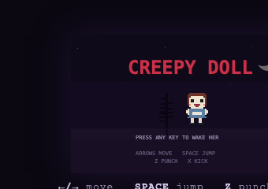
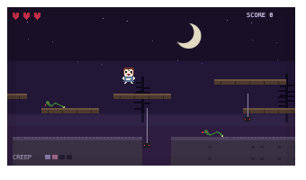
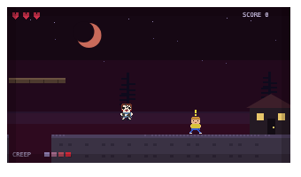

# Creepy Doll

An 8-bit style platformer. You are a porcelain doll on a long walk through the night —
and the further she goes, the worse she looks. Scratches spread across her face, her
dress gets filthier, a button eye goes missing, and the music box she walks to slowly
drifts out of tune.

At the end of the road a healthy kid is standing outside a dollhouse.
**She only wants to touch them.** Tag the kid to win.



## Play

No build, no dependencies — open `index.html` in any browser, or:

```sh
python3 -m http.server 8000
# then visit http://localhost:8000
```

Press any key on the title screen to wake her (this also starts the music —
browsers require a keypress before audio can play), then **Enter** to begin.

## Controls

| Key | Action |
|-----|--------|
| ← / → (or A / D) | walk |
| Space (or ↑ / W) | jump |
| Z (or J) | punch |
| X (or K) | kick |
| C | crouch (toggle) |
| ↓ (or S), held 2s | charge a power jump |

That's everything she can do. Crouching shrinks her, lets her duck under
swooping bats, and slows her walk to a wary shuffle. Holding ↓ on the
ground makes her coil up — after two seconds she trembles, and the next
jump launches her about twice as high.

## The rules of the night

- **Enemies:** bats swoop at you, spiders drop from silk threads, snakes patrol the
  ground (snakes take two hits). Punch or kick them before they touch you.
  Defeating a bat gives one heart back if she's hurt. A spider's silk thread can be
  struck instead of the spider — three hits snap the web, the spider dies with it,
  and it's worth 200 points.
- **Hearts:** you have five. Enemy contact costs one. Falling into a pit ends the
  run outright — the dark keeps her.
- **Creep meter:** advancing through the level raises her creepiness through four
  stages. Each stage cracks the porcelain a little more, stains the dress, reddens
  the moon — and sours the lullaby.
- **The goal:** reach the dollhouse at the end. The kid will run. Catch them.
- **Carnival doors:** three glowing doorways stand along the road, a few screens
  apart. Press **↑** in front of one to step into a minigame world (each door
  works once):
  - **Doll Toss** — time the power meter (Z) and land a little rag doll in the
    moving bucket. Up to +900.
  - **Dart & Balloon** — aim with ↑/↓, throw darts with Z. Pop three of four
    balloons to win. When a balloon pops... it wasn't air in there.
  - **Coffin Shuffle** — watch which coffin hides the heart, follow it through
    the shuffle, open it with Z. Right guess heals a heart, +200.
- **The dragon:** survive a minute and a purple dragon with no eyes arrives and
  follows her. Jump onto its back to ride and fly freely (arrows). While flying,
  **punch (Z)** breathes a short gust of flame and **kick (X)** spits a flame
  ball that roasts anything it touches. Press **C** to hop off.




## Tech

Single `game.js`, plain canvas 2D at 320×176 internal resolution, integer-scaled with
`image-rendering: pixelated`. All sprites are authored as pixel strings and rendered to
offscreen canvases at load; the doll's four decay stages are overlay layers composited
onto the same base sprite. Music and sound effects are generated with the Web Audio
API (a triangle-wave "music box" lullaby over a low detuned drone — the melody gains
random detune as the creep stage rises).
